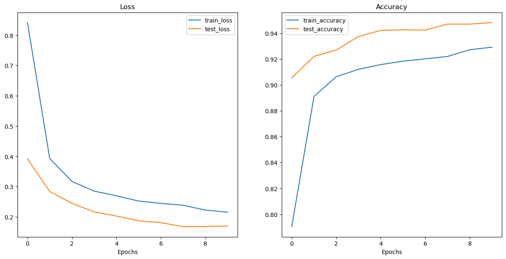

# CropGuardian

## Overview

**CropGuardian** is an AI-powered application designed to classify diseases in crops such as tomatoes, potatoes, and peppers. It can also classify five different crops - wheat, jute, sugarcane, rice and maize. It leverages the EfficientNetB2 model, fine-tuned on a custom dataset, to provide accurate and efficient crop disease detection.

## Table of Contents

- [Introduction](#introduction)
- [Features](#features)
- [Installation](#installation)
- [Usage](#usage)
- [Dataset](#dataset)
- [Model Training](#model-training)
- [Results](#results)
- [Contributing](#contributing)
- [License](#license)

## Introduction

Crop diseases pose a significant threat to food security and agricultural productivity. Early and accurate detection of crop diseases can help mitigate these threats. CropGuardian is developed to assist farmers and agricultural experts by providing a reliable tool for crop disease identification.

## Features

- **EfficientNetB2 Model**: Utilizes a pre-trained EfficientNetB2 model for feature extraction and fine-tuned for specific crop diseases.
- **Multi-Class Classification**: Supports classification of multiple crop diseases including healthy, early blight, and late blight for tomatoes, potatoes, and peppers.
- **User-Friendly Interface**: Easy-to-use interface deployed on Hugging Face Spaces for real-time disease detection.

## Installation

### Prerequisites

- Python 3.7 or higher
- Conda package manager
- Git

### Setting Up the Environment

1. Clone the repository:

    ```bash
    git clone https://github.com/yourusername/CropGuardian.git
    cd CropGuardian
    ```

2. Create a conda environment using the provided `environment.yml` file:

    ```bash
    conda env create -f environment.yml
    conda activate vision_env
    ```

3. Install the package:

    ```bash
    pip install -e .
    ```

## Usage

### Running the App Locally

To run the application locally, use the following command:

```bash
python demos/app.py
```

### Using the Hugging Face Spaces Deployment

You can also use the web app deployed on Hugging Face Spaces: [CropGuardian on Hugging Face](https://huggingface.co/spaces/sumeetchougule/crop_guardian)

## Dataset

The dataset used in this project consists of images of healthy and diseased crop leaves. The dataset is split into training and testing sets to evaluate the model's performance.

## Model Training

### Training ViT from Scratch

Training a model from scratch involves using the custom dataset to train a new Vision Transformer model. The training script to train ViT from scratch is located in `training/ViT_scratch.py`.

```bash
python training/ViT_scratch.py 
```

The training loss decreases but rises again and keeps flutuating. Our model is severely underfitting due to the smaller dataset.

### Fine-Tuning Pre-Trained Model

The pre-trained EfficientNetB2 model is fine-tuned on the custom dataset. The fine-tuning script is located in `training/train_model.py`.

```bash
python training/train_model.py
```

## Results

### From-Scratch Model Plots

Include training loss and accuracy plots for the model trained from scratch.


### Pretrained Model Plots

Include training loss and accuracy plots for the fine-tuned pre-trained model.



These results highlight the advantages of using pretrained models, especially when working with small datasets. By including these visualizations and comparisons, we can effectively demonstrate the improvements achieved through transfer learning and the capabilities of the ViT architecture.

## Contributing

Contributions are welcome! Please open an issue or submit a pull request for any improvements or bug fixes.

## License

This project is licensed under the MIT License. See the [LICENSE](LICENSE) file for details.
